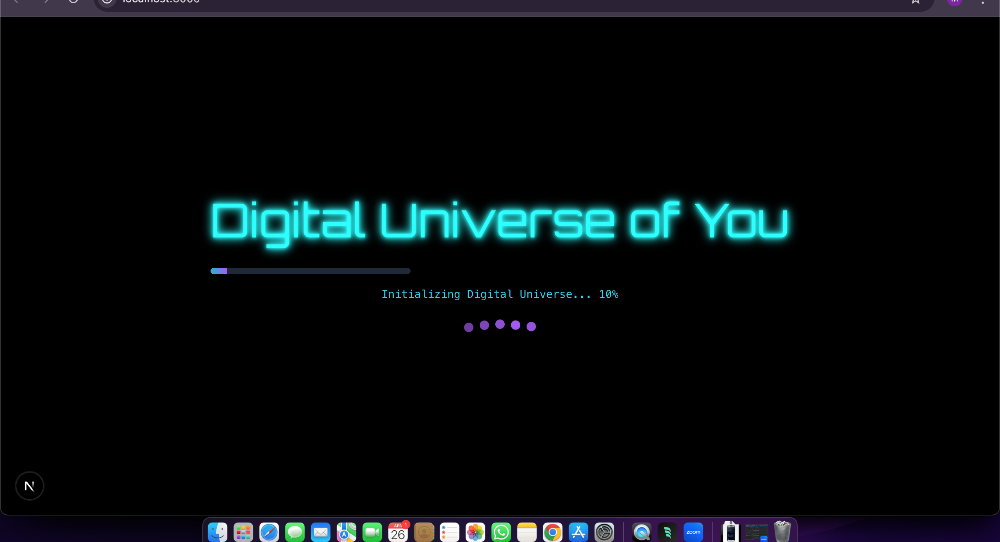
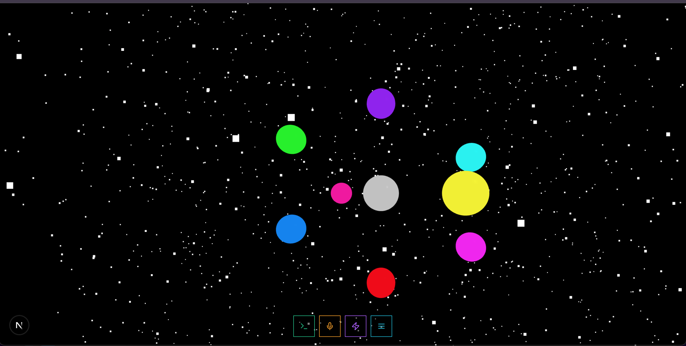
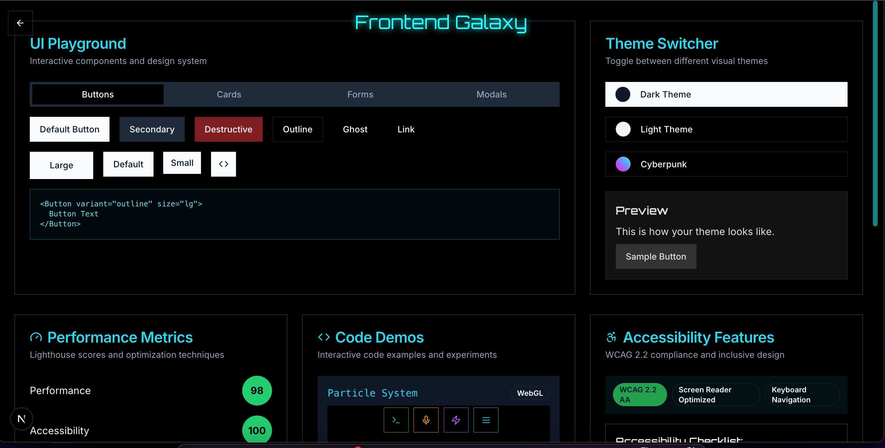
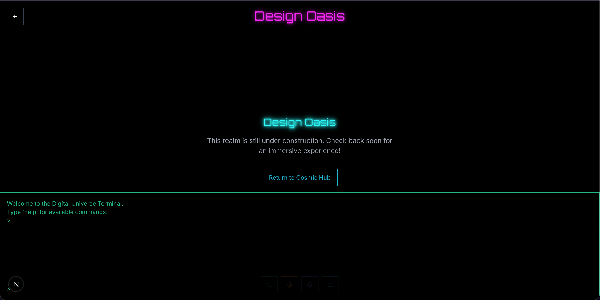
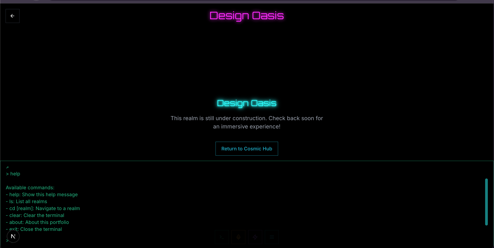

# 3D Universe Portfolio

A futuristic, interactive portfolio website built with Next.js, Three.js, and TypeScript, featuring a stunning 3D cosmic interface.

Live Demo > [https://3d-universe-portfolio.vercel.app/](https://3d-universe-portfolio.vercel.app/)

## Features

- 🌌 3D Interactive Cosmic Scene
- 🌌 Realm-based Portfolio System
  - 🎨 Frontend Realm
  - 🛠️ Backend Realm
  - 🤖 AI & Machine Learning Realm
  - 📱 Mobile Development Realm
  - 🌐 Web3 & Blockchain Realm and more
- 💫 AI Chatbot Integration
- 🌐 Advanced Navigation System
- 💻 OS Terminal Interface
- 🎨 Modern, Responsive Design
- 🌙 Dark Theme Support
- 🔄 Real-time 3D Animations
- 🔄 Modular Component Architecture

## Tech Stack

- **Framework**: Next.js 14
- **Language**: TypeScript
- **Styling**: Tailwind CSS
- **3D Engine**: Three.js
- **UI Components**: Radix UI
- **Package Manager**: pnpm

## Getting Started

### Prerequisites

- Node.js (v18 or higher)
- pnpm (v7 or higher)

### Installation

1. Clone the repository:

```bash
git clone https://github.com/Ayomisco/3D-universe-portfolio.git
```

2. Navigate to the project directory:

```bash
cd 3D-universe-portfolio
```

3. Install dependencies:

```bash
pnpm install
```

4. Start the development server:

```bash
pnpm dev
```

5. Open [http://localhost:3000](http://localhost:3000) in your browser.

## Project Structure

```
3D-universe-portfolio/
├── app/              # Next.js app directory
├── components/       # Reusable UI components
├── hooks/           # Custom React hooks
├── lib/             # Utility functions and configurations
├── public/          # Static assets
└── styles/          # Global styles and Tailwind configurations
```

## Contributing

1. Fork the repository
2. Create your feature branch (`git checkout -b feature/AmazingFeature`)
3. Commit your changes (`git commit -m 'Add some AmazingFeature'`)
4. Push to the branch (`git push origin feature/AmazingFeature`)
5. Open a Pull Request

## License

This project is licensed under the MIT License - see the [LICENSE](LICENSE) file for details.

## Acknowledgments

- Thanks to the Next.js team for their amazing framework
- Special thanks to the Three.js community for their documentation and examples
- Appreciation to all contributors who have helped improve this project

## Screenshots

Here are some screenshots showcasing the project:

### Loading Screen



### Galaxy View



### Frontend Interface



### Design & Chat


### Terminal Interface



### Terminal Interface 2


